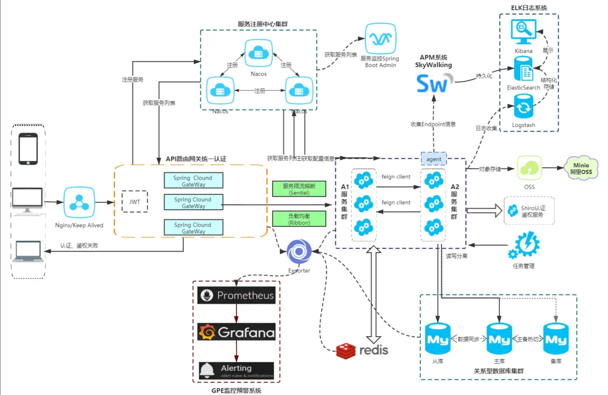

# 架构设计目的

- 架构设计是为了解决软件复杂度带来的问题
    - 通过熟悉和理解需求，识别系统复杂性所在的地方，然后针对这些复杂点进行架构设计。
    - 架构设计并不是要面面俱到，不需要每个架构都具备高性能、高可用、高扩展等特点，而是要识别出复杂点然后有针对性地解决问题。
    - 理解每个架构方案背后所需要解决的复杂点，然后才能对比自己的业务复杂点，参考复杂点相似的方案。

# 架构设计流程

## 1. 需求介绍

+ [需求介绍主要描述需求的背景、目标、范围等]
    - 核心业务：下注 充值 会员 代理 日志 事务 日志耗时
    - 性能问题：当用户发布了一条微博后，微博发布子系统需要同步调用“统计子系统”“审核子系统”“奖励子系统”等共 8 个子系统，性能很低。
    - 耦合问题：当新增一个子系统时，例如如果要增加“广告子系统”，那么广告子系统需要开发新的接口给微博发布子系统调用。
    - 效率问题：每个子系统提供的接口参数和实现都有一些细微的差别，导致每次都需要重新设计接口和联调接口，开发团队和测试团队花费了许多重复工作量。

## 2. 需求分析

- [需求分析主要全方位地描述需求相关的信息]
    + [5W 指 Who、When、What、Why、Where。Who：需求利益干系人，包括开发者、使用者、购买者、决策者等。When：需求使用时间，包括季节、时间、里程碑等。What：需求的产出是什么，包括系统、数据、文件、开发库、平台等。Where：需求的应用场景，包括国家、地点、环境等，例如测试平台只会在测试环境使用。Why：需求需要解决的问题，通常和需求背景相关]
        - Who：emc主要是业务子系统来使用，子系统发送消息或者接收消息。
        - When：当子系统需要发送异步通知的时候，需要使用emc。
        - What：需要开发emc。
        - Where：开发环境、测试环境、生产环境都需要部署。
        - Why：emc将子系统解耦，将同步调用改为异步通知。
    + 1H[How是关键业务流程。有的系统这部分内容很简单，但有的业务系统 1H 就是具体的用例文档”]
        - emc有几大核心功能：。
    + 8C[8C 指的是 8 个约束和限制，即 Constraints，包括性能 Performance、成本 Cost、时间 Time、可靠性 Reliability、安全性 Security、合规性 Compliance、技术性 Technology、兼容性 Compatibility]
    注：需求中涉及的性能、成本、可靠性等仅仅是利益关联方提出的诉求，不一定准确；如果经过分析有的约束没有必要，或成本太高、难度太大，这些约束是可以调整的。
        - 性能：需要达到 Kafka 的性能水平。
        - 成本：参考 XX 设计方案，不超过 10 台服务器。
        - 时间：期望 3 个月内上线第一个版本，在两个业务尝试使用。
        - 可靠性：按照业务的要求，emc的可靠性需要达到 99.99%。
        - 安全性：emc仅在生产环境内网使用，无需考虑网络安全；如消息中有敏感信息，消息发送方需要自行进行加密，cocos图片加密混淆。
        - 合规性：emc需要按照目前的 DevOps 规范进行开发。
        - 技术性：目前团队主要研发人员是 Java，最好用 Java 开发。
        - 兼容性：之前有旧系统，需考虑兼容性。

## 3. 复杂度分析

- 确定了系统面临的主要复杂度问题后，方案设计就有了明确的目标，我们就可以开始真正进行架构方案设计了。
    1. ### 问题痛点
            - mysql定时任务定时汇总到报表。
            - 玩家盈亏：查询五百万的数据，第一页十条，七秒。
    1. ### 高可用
    2. ### 高性能
    3. ### 可扩展性
    4. ### 低成本，安全，规模

    + 低成本
        - 当我们的架构方案只涉及几台或者十几台服务器时，一般情况下成本并不是我们重点关注的目标
    + 安全
        - 安全，从技术的角度来讲，安全可以分为两类：一类是功能上的安全，一类是架构上的安全。1. 功能安全例如，常见的 XSS
          攻击、CSRF 攻击、SQL 注入、Windows
          漏洞、密码破解等，本质上是因为系统实现有漏洞，黑客有了可乘之机。黑客会利用各种漏洞潜入系统，这种行为就像小偷一样，黑客和小偷的手法都是利用系统或家中不完善的地方潜入，并进行破坏或者盗取。因此形象地说，功能安全其实就是“防小偷”。从实现的角度来看，功能安全更多地是和具体的编码相关，与架构关系不大。现在很多开发框架都内嵌了常见的安全功能，能够大大减少安全相关功能的重复开发，但框架只能预防常见的安全漏洞和风险（常见的
          XSS 攻击、CSRF 攻击、SQL 注入等），无法预知新的安全问题，而且框架本身很多时候也存在漏洞
    + 规模
        - 高可用

## 4. 设计备选方案

- 备选阶段关注的是技术选型，而不是技术细节，技术选型的差异要比较明显。
    + [备选方案评估后会选择一个方案落地实施，架构设计文档就是用来详细描述细化方案的]

1. #### 总体方案

- [总体方案需要从整体上描述方案的结构，其核心内容就是架构图，以及针对架构图的描述，包括模块或者子系统的职责描述、核心流程]
  

2. #### 架构总览

- [架构总览给出架构图以及架构的描述]
    - 架构关键设计点：采用数据分散集群的架构，集群中的服务器进行分组，每个分组存储一部分消息数据。每个分组包含一台主 MySQL
      和一台备
      MySQL，分组内主备数据复制，分组间数据不同步。正常情况下，分组内的主服务器对外提供消息写入和消息读取服务，备服务器不对外提供服务；主服务器宕机的情况下，备服务器对外提供消息读取的服务。客户端采取轮询的策略写入和读取消息。

3. #### 核心流程

- 消息发送流程 消息读取流程

4. #### 详细设计

- [详细设计需要描述具体的实现细节]
    - #### 高可用设计
        - 消息发送可靠性
            + 业务服务器中嵌入emc提供的 SDK，SDK 支持轮询发送消息，当某个分组的主服务器无法发送消息时，SDK
              挑选下一个分组主服务器重发消息，依次尝试所有主服务器直到发送成功；如果全部主服务器都无法发送，SDK
              可以缓存消息，也可以直接丢弃消息，具体策略可以在启动 SDK 的时候通过配置指定。如果 SDK
              缓存了一些消息未发送，此时恰好业务服务器又重启，则所有缓存的消息将永久丢失，这种情况 SDK
              不做处理，业务方需要针对某些非常关键的消息自己实现永久存储的功能。
        - 消息存储可靠性
            + 消息存储在 MySQL 中，每个分组有一主一备两台 MySQL 服务器，MySQL 服务器之间复制消息以保证消息存储高可用。如果主备间出现复制延迟，恰好此时
              MySQL 主服务器宕机导致数据无法恢复，则部分消息会永久丢失，这种情况不做针对性设计，DBA 需要对主备间的复制延迟进行监控，当复制延迟超过
              30 秒的时候需要及时告警并进行处理。
        - 消息读取可靠性
            +
          每个分组有一主一备两台服务器，主服务器支持发送和读取消息，备服务器只支持读取消息，当主服务器正常的时候备服务器不对外提供服务，只有备服务器判断主服务器故障的时候才对外提供消息读取服务。主备服务器的角色和分组信息通过配置指定，通过
          ZooKeeper 进行状态判断和决策。主备服务器启动的时候分别连接到 ZooKeeper，在 /MQ/Server/[group]目录下建立
          EPHEMERAL 节点，假设分组名称为 group1，则主服务器节点为 /MQ/Server/group1/master，备服务器的节点为
          /MQ/Server/group1/slave。节点的超时时间可以配置，默认为 10 秒。
        - 存储的高可用：主备方案、集群方案，
        - 高性能的负载均衡、多路复用，
        - 可扩展的分层、插件化等技术
    - #### 高性能设计

> 1. 并发

### 缓存提升读写并发

- 涉及金额，订单不存缓存。redis发布订阅通知游戏更新，通知不成功，定时任务。
- 很容易出现，redis缓存不一致。玩家登陆，把库更新，redis没更新成功，机房，内网一般稳定。

> 2. io

### 数据库io瓶颈提升

#### 硬件和操作系统层面优化：

- cpu 可用内存大小 网络带宽 磁盘读写速度。应用文件句炳数 操作系统的网络配置

##### 读写分离（主写从读）

##### 背景

- 读多写少，可以容忍不一致

##### 目的

- 提升读并发

##### 主从同步失败

- 强制读主 从库只有备份作用，没有分担读压力作用
- 主从同步复制，写操作性能降低
- GTID
- 去掉读写分离，改用缓存。缓存出现读写不一致现象

##### 优劣

- 主从主要是拓展性不强，一旦并发量大了，容易把mysql连接数打满
- 两千内并发。

##### 分库分表

- 一台物理机器部署一个库，连接分散到不同库，根据不同账号进不同库，分库分表。多个物理机，并发切库
- 不同机房通过cdn解决cc攻击。服务器配置：32核32g72线程

##### mysql配置层面优化：

- binlog
- bufferpool大小配置 读写分离（主写从读）

##### 背景

- 读多写少，可以容忍不一致

##### 目的

- 提升读并发

##### 主从同步失败

- 强制读主 从库只有备份作用，没有分担读压力作用
- 主从同步复制，写操作性能降低
- GTID
- 去掉读写分离，改用缓存。缓存出现读写不一致现象

##### 优劣

- 主从主要是拓展性不强，一旦并发量大了，容易把mysql连接数打满
- 两千内并发。

##### 分库分表

- 一台物理机器部署一个库，连接分散到不同库，根据不同账号进不同库，分库分表。多个物理机，并发切库
- 不同机房通过cdn解决cc攻击。服务器配置：32核32g72线程

##### mysql配置层面优化：

- binlog
- bufferpool大小配置
- 可扩展设计
- 安全设计
    + emc需要提供权限控制功能，权限控制包括两部分：身份识别和队列权限控制。身份识别emc给业务子系统分配身份标识和接入
      key，SDK 首先需要建立连接并进行身份校验，消息队列服务器会中断校验不通过的连接。因此，任何业务子系统如果想接入emc，都必须首先申请身份标识和接入
      key，通过这种方式来防止恶意系统任意接入。队列权限某些队列信息可能比较敏感，只允许部分子系统发送或者读取，emc将队列权限保存在配置文件中，当收到发送或者读取消息的请求时，首先需要根据业务子系统的身份标识以及配置的权限信息来判断业务子系统是否有权限，如果没有权限则拒绝服务。
    + 其他设计[其他设计包括上述以外的其他设计考虑点，例如指定开发语言、符合某些标准等]
    + emc需要接入已有的运维平台，通过运维平台发布和部署。emc需要输出日志给已有的监控平台，通过监控平台监控emc的健康状态，包括发送消息的数量、发送消息的大小、积压消息的数量等，详细监控指标在后续设计方案中列出。

    - 容量规划
- 部署方案[部署方案主要包括硬件要求、服务器部署方式、组网方式等]
    + emc的服务器和数据库服务器采取混布的方式部署，即：一台服务器上，部署同一分组的主服务器和主 MySQL，或者备服务器和备
      MySQL。因为消息队列服务器主要是 CPU 密集型，而 MySQL 是磁盘密集型的，所以两者混布互相影响的几率不大。
    + 硬件的基本要求：32 核 48G 内存 512G SSD 硬盘，考虑到emc动态扩容的需求不高，且对性能要求较高，因此需要使用物理服务器，不采用虚拟机。

## 5. 架构演进规划

- [通常情况下，规划和设计的需求比较完善，但如果一次性全部做完，项目周期可能会很长，因此可以采取分阶段实施，即：第一期做什么、第二期做什么，以此类推]
- 整个emc分三期实现：
    + 第一期：实现--功能，预计时间 2 周。
    + 第二期：实现--功能，预计时间 2 周。
    + 第三期：实现--功能，预计时间 2 周。

### 技术方案选型对比

> 1. ### 存储层技术选型

#### 背景目的

- 后台所有投注记录查询，单个代理/会员的投注记录查询，代理和框架
- 数据库要求；
    1. 高吞吐；
    1. 支持ACID事务；
    1. 大数据生态友好；
    1. 有水平扩张能力，并且尽量做到不侵入业务；

| 组件选型    | 存储数据类型     | 说明   | 数据存储 | 存储方式          |适合场景     |    架构特点 | 优点                                                                                        | 缺点                                                            | 事务                         | 数据一致性                  | join操作 |
|---------|------------|------|------|---------------|-----|-----|-------------------------------------------------------------------------------------------|---------------------------------------------------------------|----------------------------|------------------------|--------|
| mongodb | 不确定，可扩展的数据 | 非关系型 |  以类JSON的文档的格式存储    | 虚拟内存+持久化 数据是存储在硬盘上的，只不过需要经常读取的数据会被加载到内存中，将数据存储在物理内存中，从而达到高速读写。 | 事件的记录，内容管理或者博客平台等    | 可以通过副本集，以及分片来实现高可用    | 快速！在适量级的内存的Mongodb的性能是非常迅速的，它将热数据存储在物理内存中，使得热数据的读写变得十分快。 高扩展性，存储的数据格式是json格式！         | ① mongodb支持多文档事务操作。 mongodb占用空间过大。 开发文档不是很完全，完善。 （本身没有带事务机制，需要在MongoDB中实现事务机制，需要通过一个额外的表，从逻辑上自行实现事务） | MongoDB 4.0对多文档ACID事务的支持（1、多文档事务仅适用于副本集。注：如果是单机，需切到副本集模式。 2、仅适用于WiredTiger存储引擎。 3、如果你的架构是分片Sharding模式，事务是不支持的。分布式事务计划在4.2版本里支持。 4、事务只支持CRUD操作，DDL、DCL操作不支持。 注：CRUD就是MySQL的DML，意思一样叫法不同而已。 5、事务无法在config、admin和local系统数据库中读取或写入。 6、事务无法在system.*(系统集合)里写入。 7、不能有大事务写入，写入集不能超过16MB(类似MariaDB Galera Cluster写入集wsrep_max_ws_size限制)，否则客户端直接报错。 注：如果有大事务，应该考虑将这些大事务拆分成若干块较小的事务。例如将大于2018年的状态值更改为1，应考虑循环1万条一批量更新，这一点跟MySQL玩法一样。 ） | 如果需要同步到其他组件，数据一致性和运维复杂 | 不支持    |
| mysql   |            | 关系型  |      |               |     |     | 在不同的引擎上有不同 的存储方式。 查询语句是使用传统的sql语句，拥有较为成熟的体系，成熟度很高。  开源数据库的份额在不断增加，mysql的份额页在持续增长。 | 在海量数据处理的时候效率会显著变慢。                                            |                            |                        | 支持     |

- Mysql和Mongodb主要应用场景
  1.如果需要将mongodb作为后端db来代替mysql使用，即这里mysql与mongodb 属于平行级别，那么，这样的使用可能有以下几种情况的考量：
  (1)mongodb所负责部分以文档形式存储，能够有较好的代码亲和性，json格式的直接写入方便。(如日志博客之类)
  (2)从datamodels设计阶段就将原子性考虑于其中，无需事务之类的辅助。开发用如nodejs之类的语言来进行开发，对开发比较方便。
  (3)mongodb本身的failover机制，无需使用如MHA之类的方式实现。
  2.将mongodb作为类似redis ，memcache来做缓存db，为mysql提供服务，或是后端日志收集分析。
  考虑到mongodb属于nosql型数据库，sql语句与数据结构不如mysql那么亲和 ，也会有很多时候
  将mongodb做为辅助mysql而使用的类redis memcache 之类的缓存db来使用。 亦或是仅作日志收集分析。

#### mongodb

- 不太适合放订单，金额。怎么保证事务，怎么聚合怎么查。 金额，账变，注单等避免分布式事务， 减少join操作，分多个库，然后

#### mysql分库分表，数据聚合同步到es

- 一台物理机器部署一个库，连接分散到不同库，根据不同账号进不同库，分库分表。多个物理机，并发切库。mysql
- 只需要做数据聚合同步，避免分布式事务。

#### 数据一致性

- mysql实现本地事务，减少分布式事务

 分布式事务

- mq实现弱一致性

> 2. ### 应用层技术选型

- 框架sprignboot+springcloud

> 3. ### 基础设施技术选型

#### 接入部署技术选型

- 机房配置

##### 运维架构容灾

- 两地三中心(异地双机房)

## 5. 评估和选择备选方案

## 6. 详细方案设计

结尾：

- mq削峰填谷或者db。
- es物理库的订单查询。一两亿一两秒。
- kafka把消息发到大数据。
- 冷热备份，产品限制查两个月，分区表，一天一千万。

